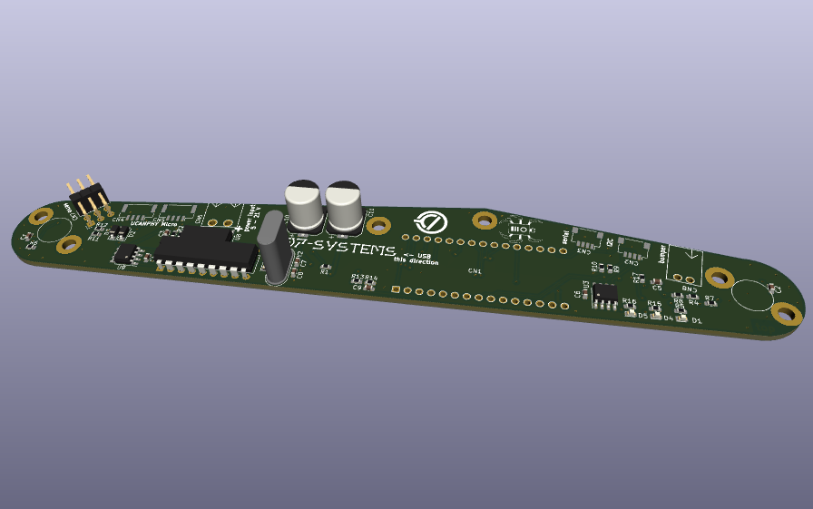
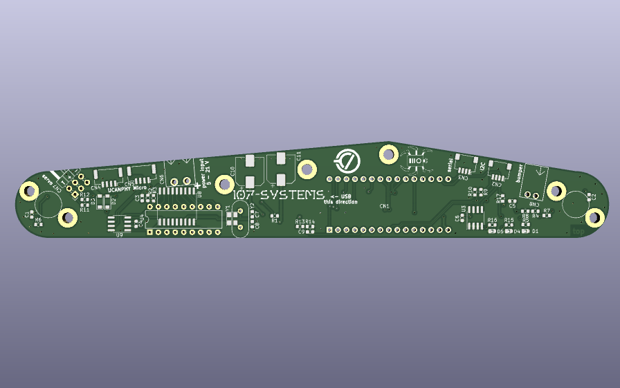
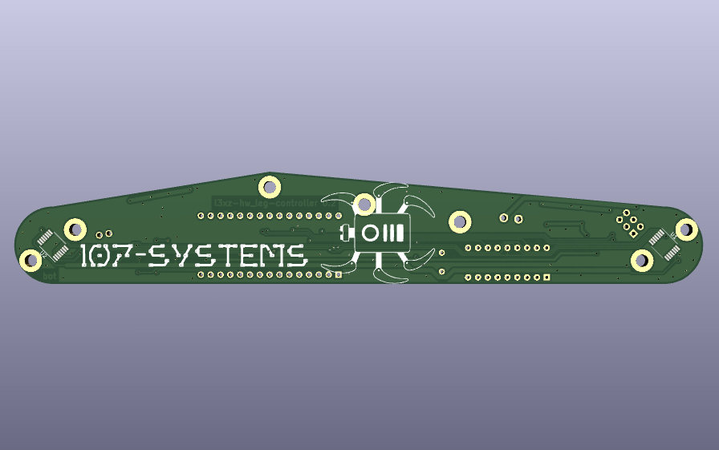

`l3xz-leg-ctrl-hardware`
========================

Leg controller for the [L3X-Z Hexapod](https://github.com/107-systems/l3xz-hw).

  

## 3D Rendering

  </a>

## Firmware
[l3xz-leg-ctrl-firmware](https://github.com/107-systems/l3xz-leg-ctrl-firmware)

## Pin Usage
### Arduino Nano 33 IoT connector CN1
| **Pin** | **Pin Name** | **Signal**    | **Description**                  |
|:-------:|:------------:|:-------------:|:--------------------------------:|
| 1       | D13/SCK      | SPI_SCK       | SPI for CAN and AS5048 encoder   |
| 2       | +3V3         | 3V3-rail      | supply voltage for board         |
| 3       | AREF         |               |                                  |
| 4       | DAC0/A0      |               |                                  |
| 5       | A1           | +BATT_MEAS    | measurement of input voltage     |
| 6       | A2           |               |                                  |
| 7       | A3           |               |                                  |
| 8       | A4/SDA       | I2C_SDA       | I2C for eeprom and qwiic         |
| 9       | A5/SCL       | I2C_SCL       | I2C for eeprom and qwiic         |
| 10      | A6           | LED3          | status LED 3                     |
| 11      | A7           | LED2          | status LED 2                     |
| 12      | VUSB/+5V0    |               |                                  |
| 13      | REC/RESET    | RESET         | Reset                            |
| 14      | GND          | GND           | GND                              |
| 15      | VIN          | power input   | power input for board            |
| 16      | D1/TX        | SERIAL_TX     | to connector CN3                 |
| 17      | D0/RX        | SERIAL_RX     | to connector CN3                 |
| 18      | RESET        | RESET         | Reset                            |
| 19      | GND          | GND           | GND                              |
| 20      | D2           | LED1          | status LED 1                     |
| 21      | D3           | MCP2515_CS    | chip select for CAN              |
| 22      | D4           | AS5048_1_CS   | chip select for AS5048 1         |
| 23      | D5           | AS5048_2_CS   | chip select for AS5048 2         |
| 24      | D6           | BUMPER        | input for bumper                 |
| 25      | D7           | SERVO1        | PWM output for servo 1           |
| 26      | D8           |               |                                  |
| 27      | D9           | MCP2515_INT   | CAN interrupt                    |
| 28      | D10          | SERVO2        | PWM output for servo 2           |
| 29      | D11/MOSI     | SPI_MOSI      | SPI for CAN and AS5048 encoder   |
| 30      | D12/MISO     | SPI_MISO      | SPI for CAN and AS5048 encoder   |

### Qwiic I2C connector CN2
JST SH 1mm 4-pin.

| **Pin** | **Signal**    |
|:-------:|:-------------:|
| 1       | GND           |
| 2       | VCC           |
| 3       | I2C_SDA       |
| 4       | I2C_SCL       |

### Serial connector CN3
JST SH 1mm 4-pin.

| **Pin** | **Signal**    |
|:-------:|:-------------:|
| 1       | GND           |
| 2       | VCC           |
| 3       | SERIAL_TX     |
| 4       | SERIAL_RX     |

### Dronecode CAN connector CN4 and CN5
JST GH 1.25mm 4-pin.

| **Pin** | **Signal**    |
|:-------:|:-------------:|
| 1       | CANVCC        |
| 2       | CANH          |
| 3       | CANL          |
| 4       | GND           |

### Power Input CN6
Würth WR-TBL 3.81mm 2-pin.

| **Pin** | **Signal**    |       **Description**        |
|:-------:|:-------------:|:----------------------------:|
| 1       | V-IN          | Directly to Arduino Nano VIN |
| 2       | GND           |                              |

Attention: V_IN is 5 to 21 V and is directly connected to VIN of the Arduino with a diode for reverse polarity protection.
It is also directly connected to +5V of the servo connector. So it should be limited to +6V if servos are used.

### Cervo connector CN7
2x3 pin-header 2.54 mm.

| **Pin** | **Signal**    | **Description**                  |
|:-------:|:-------------:|:--------------------------------:|
| 1+2     | servo-pwm     | 50 Hz pulse signal               |
| 3+4     | +5V           | directly connected to VIN        |
| 5+6     | GND           |                                  |

### Bumper Connector CN8
WAGO 733-362 2.5mm 2-pin.

| **Pin** | **Signal**    | **Description**                  |
|:-------:|:-------------:|:--------------------------------:|
| 1       | BUMPER        | 10k pull up to +3.3V             |
| 2       | GND           |                                  |

## BOM

| **Designator** | **Part Name**             | **Link**                  |
|:--------------:|:-------------------------:|:--------------------------------:|
| C1, C2, C3, C4, C5, C6, C9 | Capacitor 0603 100nF 25V  |           |
| C7, C8         | do not install            |           |
| C10, C11       | do not install            |           |
| CN1            | Arduino Nano              | https://www.reichelt.de/praez-buchsenleisten-2-54-mm-1x15-gerade-mpe-115-1-015-p187279.html |
| CN2, CN3       | JST SH SM04B-SRSS-TB      |                                  |
| CN4, CN5       | JST GH SM04B-GHS-TB       | https://www.voelkner.de/products/1102742/JST-Stiftgehaeuse-Platine-GH-Polzahl-Gesamt-4-Rastermass-1.25mm-SM04B-GHS-TB-LF-SN.html           |
| CN6            | Würth WR-TBL 691322310002 |                                  |
| CN7            | Pinheader 2.54 mm 2x3     | https://www.reichelt.de/stiftleisten-2-54-mm-2x03-gewinkelt-mpe-088-2-006-p119904.html      |
| CN8            | WAGO 733-362              | https://www.reichelt.de/print-stiftleiste-micro-rm-2-5-gewinkelt-2-pol--wago-733-362-p45863.html |
| D1             | LED 0603 green            | https://www.reichelt.de/led-smd-1608-0603-gruen-112-mcd-120--led-el-0603-gr1-p156254.html   |
| D2, D3         | MBR0530T1G                | https://www.reichelt.de/schottkydiode-30-v-0-5-a-sod-123-mbr0530t1g-ons-p219621.html        |
| D4             | LED 0603 yellow           | https://www.reichelt.de/led-smd-1608-0603-gelb-180-mcd-120--led-el-0603-ge-p156259.html     |
| D5             | LED 0603 red              | https://www.reichelt.de/led-smd-1608-0603-rot-180-mcd-120--led-el-0603-rt-p156256.html      |
| R1, R2, R3, R4, R6, R7, R8, R9, R10, R14 | Resistor 0603 10k         |           |
| R5, R15, R16   | Resistor 0603 3k3         |           |
| R11, 12        | do not install            |           |
| R13            | Resistor 0603 100k        |           |
| U1, U2         | AS5048A                   |           |
| U3             | 24LC64-I/SN               | https://www.reichelt.de/eeprom-seriell-64-kb-8-k-x-8-i2c-2-5--5-5-v-so-8-24lc64-i-sn-p40079.html |
| U4             | MCP2515-I/P DIP-18        | https://www.reichelt.de/can-controller-mit-spi-schnittstelle-dil-18-mcp-2515-i-p-p54514.html |
| U8 alternative | MCP2515-I/SO SO-18        | https://www.reichelt.de/can-controller-mit-spi-schnittstelle-2-7--5-5-v-so-18-mcp-2515-i-so-p54515.html |
| U9             | SN65HVD232D               |           |
| U9 alternative | SN65HVD230D               | https://www.reichelt.de/high-speed-can-transceiver-1-mbit-s-3-3-v-so-8-sn-65hvd230d-p58427.html |
| Y1             | Quartz 16 MHz 5x2.5mm     | https://www.reichelt.de/keramik-smd-quarz-3x5x1mm-16-0mhz-16-000000-mj-p85005.html          |

## PCB
### Top

  </a>

### Bottom

  </a>

